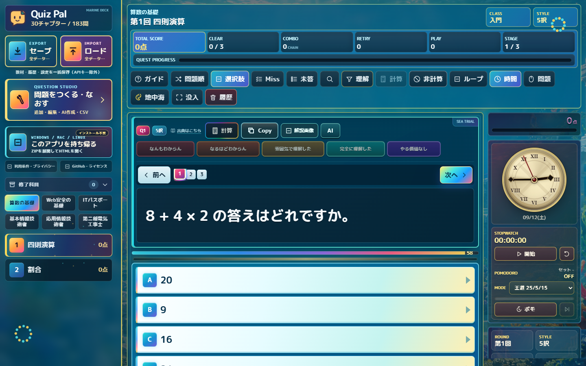
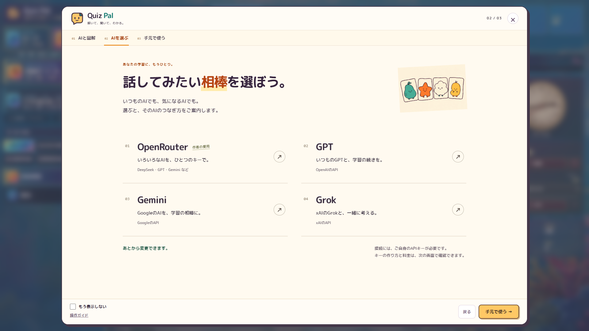
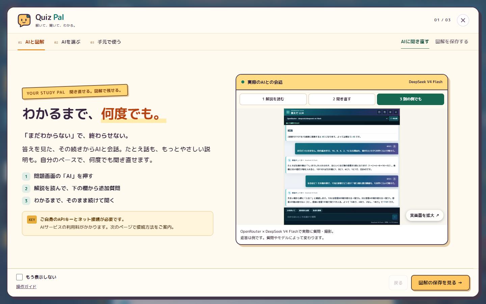
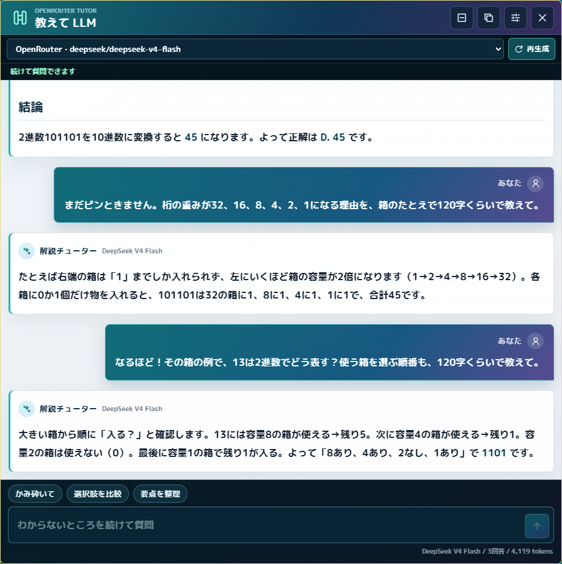
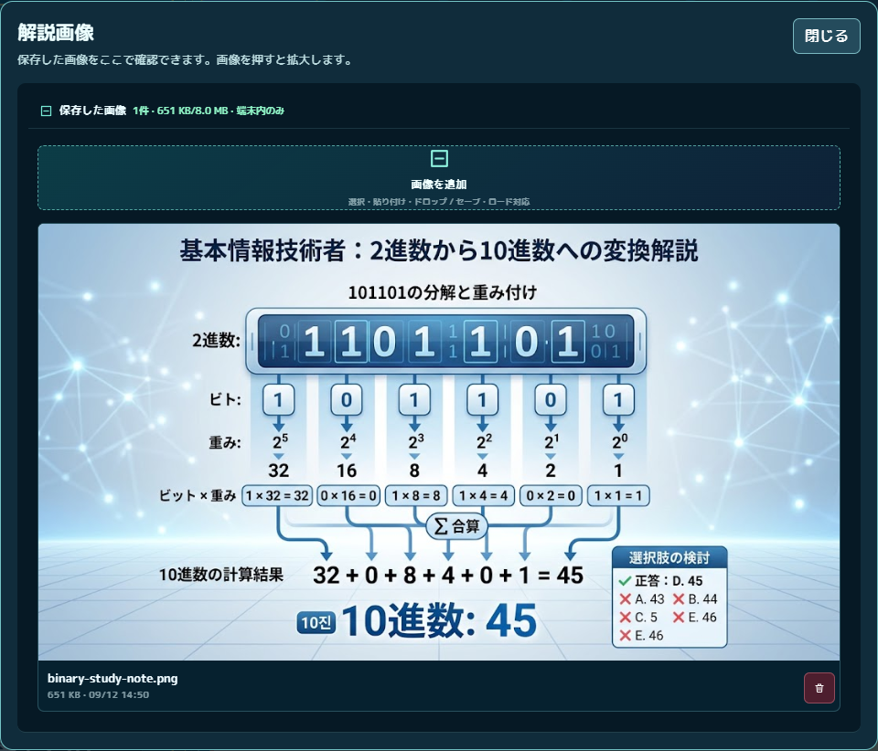

公害防止管理者試験の勉強中に、自分が本当に必要とした機能を形にしたアプリです。  
作り手自身が使い手なので、実際の学習で困ったことを出発点に、必要な機能を考えました。  
難しかったのは、作問・AIへの質問・画像保存など増えていく機能を、勉強に集中できる使いやすい画面にまとめることでした。

# Quiz Pal

**わかるまで、何度でも。** クイズの続きをAIと話し、外部で作った図解を保存して、自分のペースで学べる学習ページです。

> コンテスト提出版 v1.0.0。2026年9月12日付で、公開確認を完了し、致命的な不具合の修正以外を凍結します。審査対象はタグ `v1.0.0`。詳細は[凍結方針](FREEZE.md)を参照してください。

[Web版](https://hinahina-vr.github.io/quiz-pal/) · [ソース](https://github.com/hinahina-vr/quiz-pal) · [HTML版ZIP](docs/downloads/Quiz-Pal-HTML.zip) · [検証記録](QA.md)



実行時の外部ライブラリは使用していません。

## できること

- 科目・セクションを選び、5択問題で学習する
- 「理解度を選ぶ」から状態を記録し、学習履歴や試験別の正解数を確認する
- 手入力やCSVで自分の教材を追加・編集する
- 科目を削除する、修了科目として通常一覧から隠す、再び表示する
- 「解説画像」へ画像を保存し、ボタンから見返す
- 教材・履歴・画像をセーブし、別の環境へロードして移す
- 任意の「AIにきく」機能で質問を続けたり、教材作成を支援してもらう

## まず3分で試す

1. 科目とセクションを選び、5択の問題に答えます。
2. 「理解度を選ぶ」を押して状態を選び、次の問題へ進みます。
3. 「解説画像」で画像を追加し、一度閉じてから再び開きます。
4. 「問題をつくる・なおす」で教材を編集します。
5. 「セーブ」でJSONを書き出します。移動先では「ロード」で読み込みます。

出題、手動編集、CSV、画像、セーブ／ロードにはAPIキーやアカウント登録は不要です。紹介画面は「もう表示しない」にチェックするまで毎回表示します。「紹介」から開き直してチェックを外せば、再び毎回表示できます。紹介の右上の「×」、左下の「操作ガイド」、または紹介の最後から、実際のボタンを照らす9段階の操作ガイドへ続きます。

## AIを選ぶ画面

紹介は連続してスクロールでき、現在位置とタブが連動します。AIを選ぶと接続手順が展開されます。「AIを選び直す」で一覧へ戻れます。実会話と図解保存へはタブからも移動できます。



## AIについて

AIへの質問・教材作成には、利用者自身のAPIキーとネット接続が必要です。OpenRouter、OpenAI、Gemini、Grokなどの設定案内を用意しています。利用条件や料金は各サービスに従います。

APIキーは既定でタブ内に一時保存します。ローカルHTML版では、利用者が確認ダイアログで許可した場合だけ、このブラウザープロファイルへ保存できます。キーは端末内に平文で保存されるため、共有端末での扱いに注意してください。許可は取消・削除でき、接続先変更時にも破棄します。セーブデータにはキーも保存許可も含めません。作品提供者のAPIキーは配布していません。AIを設定しなくても基本機能を試せます。

v1.0.0ではバックアップ内の教材キャッシュを検証し、実行可能なHTML等を除去します。紹介の表示用画像を軽量化し、拡大表示は元画像を保持しました。背景アニメーションは初期状態で停止し、設定から有効にできます。検証の対象・結果は[QA.md](QA.md)を参照してください。



## 実際の画面で見る、2つの使い方

### AIに何度でも聞き直す

問題画面の「AIにきく」から解説を開き、下の入力欄で追加質問。「もっと簡単に」「別の例で」と、前の会話を踏まえて続けて質問できます。以下はOpenRouter / DeepSeek V4 Flashへ初回と追加2回を実際に送信した画面です。



### 外部の図解を、自分のノートに残す

画像をPCへ保存し、「解説画像」→「画像を追加」で選択します。画像を押すと拡大でき、閉じた後や再読込後も保存されています。セーブ／ロードで画像ごと持ち運べます。



画像の保存・閲覧はAPIキー不要です。この機能は保管庫で、画像の生成やAIへの自動送信は行いません。

## 保存とHTML版

学習データは使っているブラウザー内へ保存します。端末・ブラウザーの変更や更新の前には、セーブしたJSONを保管してください。ブラウザーデータの削除で記録が消える場合があります。

HTML版は[ZIP](docs/downloads/Quiz-Pal-HTML.zip)をすべて展開し、`Quiz-Pal-HTML/index.html`を開いて使います。EXE・Node.js・ローカルサーバーは利用者に不要です。基本機能はオフラインで動きます。詳しい手順は[同梱ガイド](docs/README.html)を参照してください。

## 実装と開発

ブラウザーで動く部分はHTML・CSS・JavaScriptと標準APIです。実行時のnpm依存はありません。UI、CSV、保存処理、入力検証、Markdown、数式、アイコン、Canvas演出はリポジトリ内の実装を使用しています。

TypeScript・Viteは開発・ビルド用、Vitest等はテスト用です。`native-runtime.js`には互換名としてlucide・marked・DOMPurify・katexが登場しますが、それらのライブラリ本体をCDNやnpmから読み込んではいません。

開発にはNode.js 22を使用します。

```sh
npm ci
npm test
npm run typecheck
npm run dev
```

公開用の静的ファイルとHTML版ZIPをローカルで生成するには、次を実行します。この操作によるアップロードやデプロイはありません。

```sh
npm run prepare:contest
npm run check:contest
npm run preview
```

`docs/`は生成物です。編集は`src/`・`public/`・`portable/html/`と入口HTMLで行い、再生成してください。Web版とダウンロード版には同じビルドのファイルを使用し、`PUBLICATION_MANIFEST.json`にハッシュを記録します。

- [構成と制作上の工夫](DESIGN.md)
- [応募情報・説明文](SUBMISSION.md)
- [レギュレーション確認](CONTEST_COMPLIANCE.md)
- [公開記録と保守手順](PUBLISHING.md)
- [ブラウザーテストの再実行](TESTING.md)

## ライセンスと制作

アプリ本体は[MIT License](LICENSE)、オリジナル例題は[CC0 1.0](LICENSE-CONTENT)です。IPA公式問題とフォントにはそれぞれの条件が適用されます。各問題の出典表示と[第三者素材の表示](THIRD_PARTY_NOTICES.md)を参照してください。
